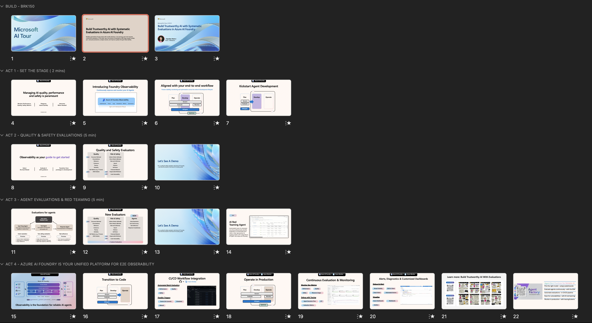

## 📋 | How to deliver this session

Thank you for delivering this theater session on AI Tour! Prior to delivering the session, please:

1. Read this document in its entirety
1. Download the presentation to your deviice
1. Watch the video walkthrough for reference
1. Ask questions of the content leads - we're here to help!

## 📁 | File Summary

| Resources          | Links                            | Description |
|-------------------|----------------------------------|-------------------|
| Session Delivery Deck     |  [Deck](https://aka.ms/AAxs6f7) | Powerpoint presentation |
| Speaker Notes | | Talk delivery guidance   |
| Demo Setup| | Demo setup guidance |
|||

## 🎙️ | Speaker Prep

This session is titled "Build Trustworthy AI with Systematic Evaluations in Azure AI Foundry". It is **only 15 minutes long** which should be just about enough to do 2 demos and some explainer slides.

**Takeaways**: The goal is to leave audience with 3 takeaways:

1. Observability is the foundation for trustworthy AI 
1. Evaluations & Red Teaming help assess reliability

Here is a high-level view of the "run of show" for this session. Every speaker differs in their delivery style and pacing - if you find yourself time-constrained, prioritize demos and deprioritize slides.

| Slides | Duration | Description |
|:---|:---|:---|
| 3 | 1 min | Introduce Yourself · Introduce topic |
| 4-7 | 2 min | Introduce Observability · Describe Flow |
| 8-10 | 4 min | Introduce Safety & Quality Evals · Demo  |
| 11-13 | 4 min | Introduce New Evaluators · Demo |
| 14 | 1 min | Introduce Red Teaming |
| 15-21 | 3 min | "Azure AI Foundry Does More!" · CTA |
| | | |

If you are time-constrained, you can reduce this to 3 minutes of talk and use the remaining time for demos. The final slide will give audience link to these slides for review later.

1. (Slide 5) Introduce Observability - _1 min_
2. (Slides 8-10) Quality & Safety Evals - _DEMO_
3. (Slides 11-13) New Evaluators - _DEMO_
4. (Slide 15) Azure AI Foundry is "Observability first" - _1 min_
5. (Slide 21) Check out resources to learn more - _1 min_

## 🚀 | Demo Prep

The theater session has 2 main demo segments. This repository is setup with notebooks that will help you walk through the demos. 

_We recommend you provision the infrastructure and run the notebooks ahead of the session._ Then adopt the "cooking demo" approach where we start the process and show end results:

1. Run notebooks before session - check portal has results
1. Show notebooks in session - run them again live
1. Walk through some key snippets - e.g., evaluator, API
1. Switch to portal to show finished results - from step 1

Encourage attendees to come talk to you after for Q&A - this gives you and them a chance to explore the code or live demo interactively with less time co

**Demo Setup**: This repository is provisioned with a devcontainer - just launch it with GitHub Codespaces (cloud) or Docker Desktop (local) to get a prebuilt development environment. Then follow these steps:

| Step   | Description 
--------------|-------------
Setup Infra   | Run deployment script
Validate      | Run deployment script
Demo 1        | Run Safety & Quality evals
Demo 2        | Run New evals
Teardown      | Delete resource group

**Demo Walkthrough**: This section will be updated with a link to step-by-step instructions for demo walkthrough - `TODO`