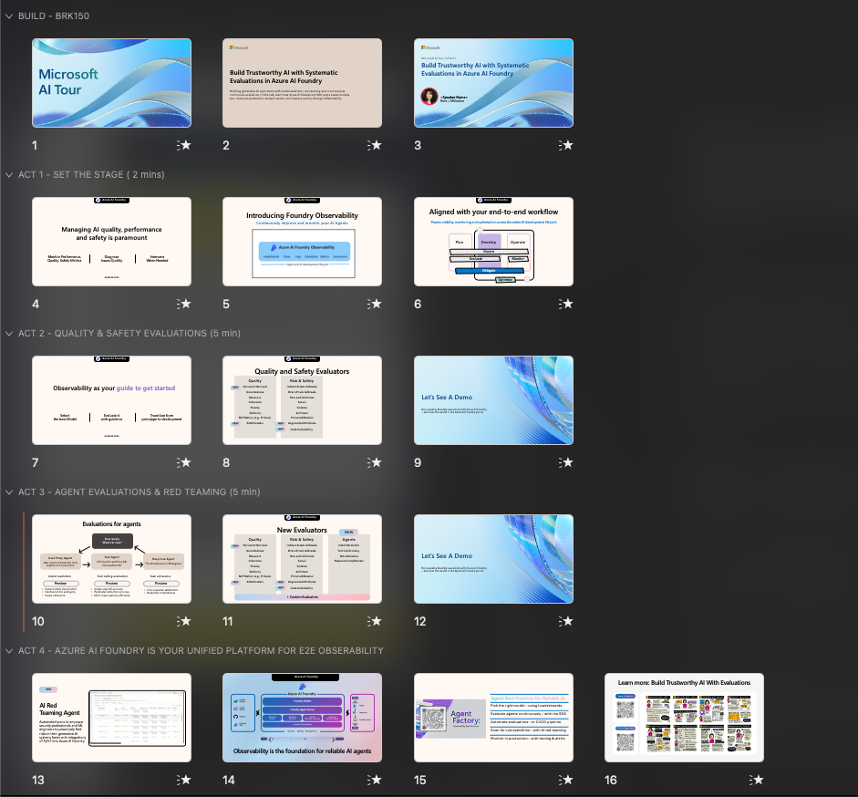

## 📋 | How to deliver this session

Thank you for delivering this theater session on the AI tour. Prior to delivery, please take a minute to:

1. Read this document in its entirety
1. Download the presentation to your deviice
1. Watch the video walkthrough for reference
1. Ask questions of the content leads - we're here to help!

## 📁 | File Summary

| Resources          | Links                            | Description |
|-------------------|----------------------------------|-------------------|
| Session Delivery Deck     |  [Deck](https://aka.ms/AAxs6f7) | Powerpoint presentation |
| Speaker Notes |  [Speaker Prep](#️--speaker-prep) | Talk delivery guidance   |
| Demo Setup| | Demo setup guidance |
|||

 

## 🎙️ | Speaker Prep

This session is titled "Build Trustworthy AI with Systematic Evaluations in Azure AI Foundry". It is **only 15 minutes long** which should be just about enough to do 2 demos and some explainer slides. This is what the current deck looks like:

Set aside 10 minutes for 2 demos. Use the remaining time to set the stage (before) and provide takeaways (after).

| Row | Time | Notes |
|:---|:---|:---|
| 1 | 1 min | Introduce Yourself & Session Title |
| 2 | 1 min | What is Observability? · E2E Workflow |
| 3 | 5 min | Model Development · `Demo`: Quality & Safety Evaluations  |
| 4 | 5 min | Agent Development · `Demo`: Agent Evaluations  |
| 5 | 3 min | Red Teaming  · Unified Platform · Best Practices |

**Two takeaways for audience**

1. Observability is the foundation for trustworthy AI
1. Azure AI Foundry offers E2E observability for AI agents

If you are time-constrained, just do the 1-min intro and the two demos - then put the final slide up with QR codes to resources.

 

## 🚀 | Demo Prep

To get started, fork this repo to your personal profile, then launch GitHub Codespaces. **This gives you a prebuilt dev environment with all dependencies installed**

Once your GitHub Codespaces environment has loaded, and you have an active VS Code terminal - go through these steps in order. **Run the notebooks ahead of time to get results ready in the portal** - then walk through demos interactively and encourage attendees to come chat with you afterwards to explore code or deployments in more detail.

| Step   | Instructions | Comments
--------------|-------------|-------
Setup    | [1. Setup Infrastructure](./demo-setup.md#1-setup-infrastructure) | Foundry Project is Ready!
Validate | [2. Validate Setup](./demo-setup.md#2-validate-setup) | Configure Local Env Vars
Demo 1   | [3. Run Notebook 1](./demo-setup.md#3-run-notebook-1) | Run Quality & Safety Evals
Demo 2   | [4. Run Notebook 2](./demo-setup.md#4-run-notebook-2) | Run Agentic Evals
| | |

This project will deploy Azure OpenAI models and an Azure AI Search resource. To prevent charges accumulating, makes sure you complete the teardown _after the theater session is done_.

| Step   | Instructions | Comments
--------------|-------------|-------
Teardown | [5. Teardown Infrastructure](./demo-setup.md#5-teardown-infrastructure) | Delete Resource Group 