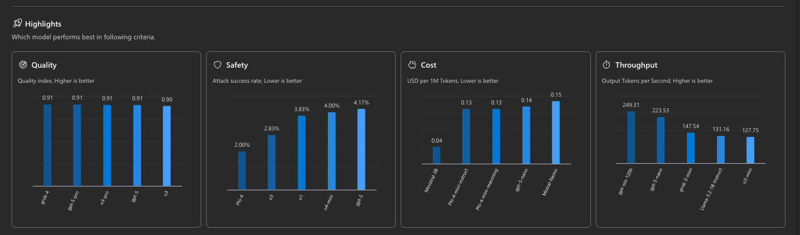
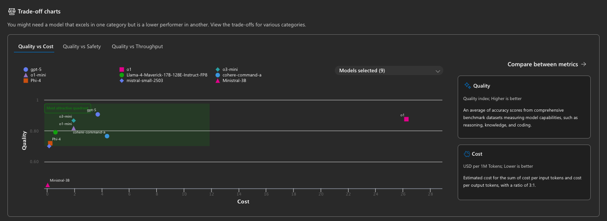
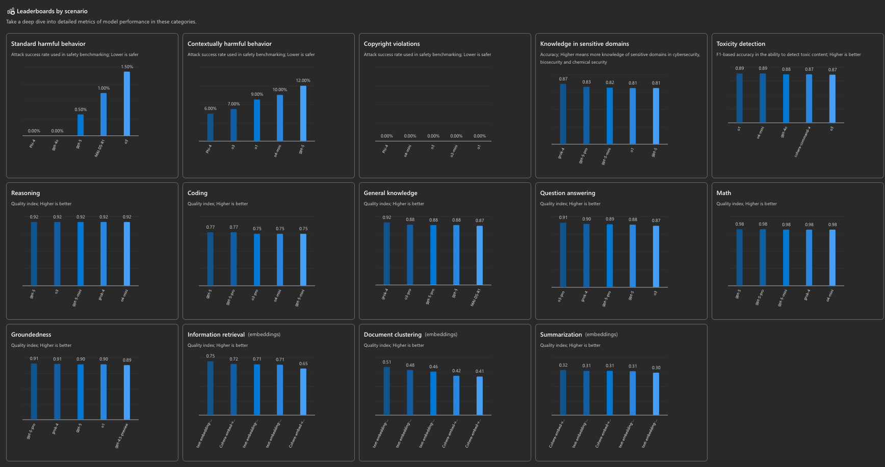
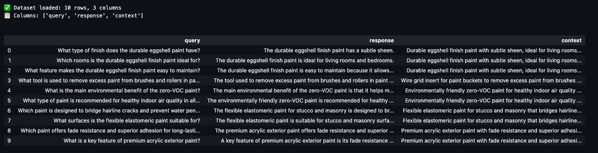

# Build trustworthy AI with systematic evaluations in Azure AI Foundry

Welcome to the train-the-trainer materials for LTG151. This is a 15-min theater session that teaches AI developers to build trustworthy AI with systematic evaluations in Azure AI Foundry.

## Pre-Requisites

To run the demos for this session you will need:

1. A personal GitHub account (to run GitHub Codespaces)
1. An Azure subscription (to host the Azure AI Foundry project)
1. An Azure AI Search service resource ([see supported regions](https://learn.microsoft.com/en-us/azure/search/search-region-support#azure-public-regions))
1. An LLM to serve as a "judge" for evaluations (e.g., gpt-4o)
1. All the [pre-requisities here](https://learn.microsoft.com/en-us/azure/ai-foundry/agents/environment-setup#prerequisites) for deploying the Bicep template.

<br/>

## Run Of Show

The Session is only 15 minutes long. Based on your familiarity with the topic you may want to do just a subset of the demos. The currently available demos are:

1. Leaderboard - Model Selection
1. Simulator - Dataset Generation
1. Evaluation - AI-Assisted Flow
1. Evaluators - Quality & Safety
1. Evaluators - Agent & More

The run of show below provides a high level view of slides with blue tiles indicating "demo stops". Each row has a core focus:

1. (Row 1) Introduce yourself and topic
1. (Row 2) What is Observability, why should you care, how to get started
1. (Row 3) What's Known: Leaderboards, Simulators & Quality/Safety evals
1. (Row 4) What's New: Agent Evalutors, Graders & Red Teaming Agent
1. (Row 5) Summary: Build trustworthy AI with observability on Foundry!


<br/>

## Step 1: Setup Infrastructure

We'll use [this setup guidance](https://learn.microsoft.com/en-us/azure/ai-foundry/agents/environment-setup) with the [Azure AI Foundry Agent Service Standard Setup](https://github.com/azure-ai-foundry/foundry-samples/tree/main/samples/microsoft/infrastructure-setup/41-standard-agent-setup) template to provision an Azure AI Foundry project and resource for this demo. The code can be found under the `infra/` folder.

**Note:** When picking a region check that it supports:
 - [Content safety](https://learn.microsoft.com/en-us/azure/ai-services/content-safety/overview#region-availability)
 - [Azure AI Search](https://learn.microsoft.com/en-us/azure/search/search-region-support#americas)
 - [Risk and Safety Evaluators](https://learn.microsoft.com/en-us/azure/ai-foundry/concepts/evaluation-evaluators/risk-safety-evaluators#azure-ai-foundry-project-configuration-and-region-support)
 - Capacity of 30 for the chosen model you want to deploy (e.g., GPT-4.1)

 _The options are ideally France Central, Sweden Central or East US2_. A backup is _North Central US_ but it lacks support for Groundedness evaluators.


1. First, update `infra/azuredeploy.parameters.json` to customize any parameters. I set:
    - _modelName_ to `gpt-4.1`
    - _modelVersion_ to `2025-04-14` to match
    - _location_ to `francecentral` 
    - _modelCapacity_ to `30`

1. Next, deploy the template by following these steps:

    ```bash
    # 1. Switch to the right folder
    cd infra

    # 2. Authenticate with Azure from VS Code
    az login

    # 3. Create resoure group with desired name and location
    az group create --name <new-rg-name> --location westus

    # 4. Deploy the template to that location.
     az deployment group create --resource-group <new-rg-name> --template-file main.bicep --parameters @azuredeploy.parameters.json

    # 5. Wait till completed
    # This can take 10-15 mins
    ```
   
1. Check if the resources were provisioned correctly:

    ```bash
    az resource list --resource-group <new-rg-name>
    ``````
1. Run script to create or update `.env`

    ```bash
    # Start from root folder of repo
     ./src/scripts/update-env.sh <new-rg-name>
    ```
1. Create an Application Insights resource (manually)
    - Visit [Azure AI Foundry portal](https://ai.azure.com)
    - Locate your Azure AI Project resource > Tracing tab
    - Click _Create new_ and complete flow to get new App Insights resource
    - Visit [Azure Portal](https://portal.azure.com) - visit resource group
    - Verify you have _7_ resource items in your resource group!

1. **CONGRATULATIONS** - Your AI project is ready!

<br/>

## Step 2: Populate Search Index

**>> THIS IS REQUIRED ONLY IF YOU ARE DOING THE SIMULATOR DEMO <<**

1. Run script to update access roles. This takes just a minute.
    ```bash
    ./src/scripts/update-roles.sh 
    ```
1. Manually add an `embedding model` to your AI Foundry Project
    - Visit [Azure AI Foundry portal](https://ai.azure.com)
    - Locate your Azure AI Project resource > Models & Endpoints tab
    - Deploy a `text-embedding-ada-002` model (manually for now)

1. To create a search index, we need an embedding model. 
    - Open the Azure AI Foundry project created earlier
    - Deploy a `text-embedding-ada-002` model for use manually 
    - This takes just a minute (We will automate this in future)

1. You can now populate the search index. 
    ```bash
    python src/scripts/setup_aisearch.py 
    ```
1. You can validate this works by visiting the [Azure Portal](https://portal.azure.com) 
    - Open your search resource page - click "Search Explorer"
    - You should see a `zava products` index.
    - Try a query like `eggshell paint`
    - You should see relevant products like `Interior Eggshell Paint`

**YOU ARE READY TO RUN NOTEBOOKS**

<br/>

## 3. Show Demos

Let's walk through each demo first. Then we'll talk through the run of show and you can decide which subset to show based on time and familiarity.

### Scenario: Zava Enterprise Retail

Zava is a fictitious enterprise retailer of home improvement goods for DIV enthusiasts. They want _you_ (the AI Engineer) to build a trustworthy AI shoppers assistant (chatbot) that can respond to user questions in a polite, helpful, and factual manner. Your mission:

1. Model Selection - find the right starting model for the job
1. Dataset Generation - create a dataset of test prompts for evaluation
1. AI-Assisted Evaluation - setup a testing harness to assess performance
1. Built-in Evaluators - select metrics to track for trustworthy AI
1. E2E Observability - there's more: tracing, red-teaming, monitoring!

**Takeaway Message** 
- Azure AI Foundry provides a unified platform for developing agentic AI
- Trustworthy AI builds on E2E observability - from plan to production!

### Demo 1: Leaderboards

[Model Leaderboards](https://learn.microsoft.com/en-us/azure/ai-foundry/concepts/model-benchmarks) streamline the model selection process using industry-standard benchmarks to assess the performance and behavior of models in the catalog. For this demo, simply keep the [Leaderboards page](https://ai.azure.com/explore/models/leaderboard) open and talk through 3 features that help model selection.

1. **Highlights: Which Models Ranks Highest?**

    - Get a sense for the top model performers for given criteria 
    - Criteria include: quality, safety, cost, or throughput.
    - This is across the _entire_ model catalog of choices (no filter)
    - Example: _gpt-5 is safest but Ministral-3B is cheapest_
        

1. **Tradeoffs: Compare Between Metrics**

    - What if top-ranked in one is lowest-ranked in another category?
    - Tradeoffs help you make sense of performance _across_ metrics.
    - Example: 
        - Ministral-3B is cheapest model but also lowest quality.
        - GPT-5 is highest quality but relatively more expensive.
        - o3-mini is middle ground in cost and quality
        

1. **Scenarios: Rank Models By Task Category**
    - The above look at a broad set of benchmarks for various categories
    - What if I wanted to look at top-ranked models for specific task?
    - o3 ranks high in Reasoning - but low in vulnerability to harmful behavior
    - gpt-5 is great at Math - but moderately vulnerable to harmful behavior
    - Use _Models selected_ filter - compare your own subset of candidates!
        

1. **Congratulations!!** - You used evaluators to do your model selection!

<br/>

### Demo 2: Simulator

Just like applications have _test-driven development_, AI applications have _evaluation-driven development_ where the "testing" assesses response quality & safety (for models) and execution efficiency (for agents). But to run tests, we need a _testing dataset_ that provides representative queries (prompts) and "ground truth" (context) that we can then use to evaluate others.

But where can you get this data if you have yet to build an application? 
- The Evaluation SDK has a Simulator to generate synthetic data
- It can generate "N" rows of test data from an Azure AI Search index
- You can now get "starter" testing datasets from your product catalog data


**Try it out**: Run the [02-simulate-dataset.ipynb](./notebooks/02-simulate-dataset.ipynb) notebook. You should see an end-result like this with 10 question-answer pairs generated based on the Azure AI Search index with a seed query on "eggshell paint". _You can now use this query/truth/response dataset as test inputs for evaluations_.



<br/>

### Demo 3: Evaluation 

<br/>

### Demo 4: Evaluators

<br/>

## 4. Teardown Infrastructure

1. Once your demos are done, don't forget to tear down the resource group!

    ```bash
    az group delete --name <new-rg-name>  --yes --no-wait
    ```

1. You will need to purge soft-deleted resources to reclaim resource names or model quota. You can do this via the portal, or using the following commands.

    1. First, locate the Azure Congitive Search resource

        ```bash
        az search service list --resource-group <new-rg-name> --query "[].name" --output table
        ```

    1. Next, purge the Azure Cognitive Search by name

        ```bash
        az resource delete --ids /subscriptions/$subscriptionId/providers/Microsoft.CognitiveServices/locations/$location/resourceGroups=$resourceGroup/deletedAccounts/$resourceName
        ```

## Congratulations!

Thank you for delivering this session