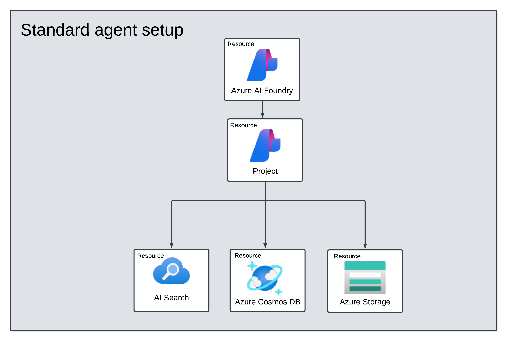

# Build trustworthy AI with systematic evaluations in Azure AI Foundry

## Step 1: Setup Infra

For this demo, let's go with a standard agent setup. This gives us the flexibility to explore more use cases later (e.g., with AI Search indexes).

This is what the standard agent setup looks like. 



1. We'll use the [recommended bicep setup](https://github.com/azure-ai-foundry/foundry-samples/tree/main/samples/microsoft/infrastructure-setup/41-standard-agent-setup) to provision this infrastructure. For convenience, we copied over the required files into the `infra/standard-agent-setup` folder in this repo.

2. Let's update[model deployment](https://learn.microsoft.com/en-us/azure/ai-foundry/agents/environment-setup#optional-model-selection-in-autodeploy-template)  to use `gpt-4.1` (model name) and "2024-05-13" (model version).

3. Update location to a region that has quota for that model - e.g., I used `westus`.

4. **Tip:** Use `export MY_RESOURCE_GROUP=<value>` to set the desired resource group as an environment variable. Then use `$MY_RESOURCE_GROUP` for the `<new-rg-name>` values.

**We are now ready to deploy**

1. First, switch to that folder:

    ```bash
    cd infra/standard-agent-setup
    ```

1. Then, authenticate with Azure from VS Code terminal:

    ```bash
    az login --tenant-id 
    ```

1. Next, create the resource group:

    ```bash
    az group create --name <new-rg-name> --location westus
    ```
1. Finally, deploy the template to that resource group. _This step can take 5-10 mins_.

    ```bash
    az deployment group create --resource-group <new-rg-name> --template-file main.bicep --parameters @azuredeploy.parameters.json
    ```
1. Check if resources got provisioned right with:

    ```bash
    az resource list --resource-group <new-rg-name>
    ``````
1. (Insights) For now, lets activate App Insights manually.
    - Visit the [Azure AI Foundry portal](https://ai.azure.com)
    - Go to the provisioned Azure AI prokect
    - Click on the _Tracing_ tab 
    - Use "Create new resource" to attach a new Application Insights resource.

**TROUBLESHOOTING**: 
 - Typical issues include naming constraints, quota availability and more. 
 - To see the specifics of an issue add `--debug` to the command above.
 - Use the GitHub Copilot for Azure extension to get more relevant information or help to debug.

<br/><br/>

## Step 2: Run Notebook 0

In this first step, we want to setup our local environment variables, then run the notebook that populates the Azure AI Search resource with our product data, so we can explore usage later.

1. First, change working directory to the root of the repository. Then create a `.env` file from the sample provided as follows:
    ```bash
    cp infra/scripts/.env.sample .
    ```
1. Open the `.env` file. You should see something like this - go ahead and fill in the values for the various variables identified. The Foundry Name and Project Name variables are the names of the corresponding _resources_ in your resource group.

    ```bash
    # .... Azure 
    AZURE_SUBSCRIPTION_ID=
    AZURE_RESOURCE_GROUP=

    # .... Azure AI Foundry
    AZURE_OPENAI_API_KEY=
    AZURE_OPENAI_ENDPOINT=
    AZURE_OPENAI_API_VERSION="2025-02-01-preview" 
    AZURE_AI_FOUNDRY_NAME=
    AZURE_AI_PROJECT_NAME=

    # .... Azure AI Foundry Deployment
    AZURE_OPENAI_DEPLOYMENT="gpt-4.1"
    AZURE_OPENAI_MODEL_VERSION="2025-04-14"

    # .... Azure AI Search
    AZURE_AISEARCH_DATAFILE="data/products.csv"
    AZURE_AISEARCH_ENDPOINT=
    AZURE_AISEARCH_INDEX="zava-products"
    ```

1. Now, you can run the script that updates RBAC values to allow your user identity to view and update the Azure AI Search resource. _This should take just a minute to complete_.
    ```bash
    ./infra/scripts/update-rbac.sh 
    ```

1. To create a search index, we need an embedding model. 
    - Open the Azure AI Foundry project created earlier
    - Deploy a `text-embedding-ada-002` model for use manually 
    - This takes just a minute (We will automate this in future)

1. You can now populate the search index. 
    - Open the `src/00-setup-aisearch.ipynb` notebook in the VS Code Editor
    - Select the Kernel (defauly Python)
    - Clear All Outputs (reset notebook)
    - Click "Run All"

1. **SUCCESS**: Successful upload should result in a message like this in the notebook. 

    ```bash
    Uploading 50 Zava products to index zava-products
    Successfully uploaded 50 products to the search index!
    The Zava product catalog is now ready for semantic search.
    ```
1. You can now visit the Azure AI Search resource in the Azure Portal, and select the _Search explorer_ option in the Overview page, to view the generated `zava-products` index. Try a test query

    ```bash
    paint living room
    ```

You may see a response like this - this validates that the search index works.

    ```bash
    "value": [
        {
        "@search.score": 4.350505,
        "id": "PFIP000004",
        "content": "Environmentally friendly zero-VOC paint for healthy indoor air quality in all living spaces.",
        "filepath": "pfip000004",
        "title": "Zero VOC Interior Paint",
        "url": "/products/pfip000004",
        "price": 52,
        "stock": 25
        },
    ```


<br/><br/>

## Step 3: Run Notebook 1 

<br/><br/>

## Step 4: Run Notebook 2 

<br/><br/>

## Step 5: Teardown Infra

**TEARDOWN**: Once the project is done, you can tear down the infrastructure using:

```bash
az group delete --name <new-rg-name>  --yes --no-wait
```

**PURGE SOFT-DELETED RESOURCES** - Soft-deleted resources may create naming conflicts or quota issues later. To purge them proactively, use these commands:

1. Find name of Azure Congitive Search resource

    ```bash
    az search service list --resource-group <new-rg-name> --query "[].name" --output table
    ```

1. Purge Azure Cognitive Search by name

    ```bash
    az resource delete --ids /subscriptions/$subscriptionId/providers/Microsoft.CognitiveServices/locations/$location/resourceGroups=$resourceGroup/deletedAccounts/$resourceName
    ```
